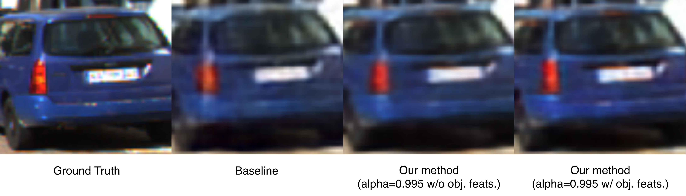

# ROI-Aware Neural Image Compression for Teleoperation

This is the repository that implements and contains the training environment of "ROI-Aware Neural Image Compression for Teleoperation" by Oriol Gorriz Viudez.
[View the paper](docs/report.pdf).

Training & testing environment is provided for the [Hyperprior](https://arxiv.org/abs/1802.01436) and our proposal, i.e., an extended variant that is described in our work.

<div align="center">
  
  <p><em>Figure 1: Visual comparison of a ROI on the KITTI 2D dataset.</em></p>
</div>

## Abstract
Teleoperated driving relies on real-time image transmission, demanding efficient compression strategies that preserve critical scene details while minimizing bandwidth usage. Traditional codecs (e.g., HEVC, AVC) apply uniform compression and lack support for variable bitrate for regions of interest (ROIs). To address this, we propose a fully neural image compression framework optimized for images captured in autonomous driving environments. Our approach integrates an object detector with a neural compressor, conditioning the compression process on object-specific features extracted from the detector. By incorporating these features as additional input to the compressor and employing a custom loss function that prioritizes ROIs, our method achieves enhanced preservation of important scene elements while reducing bitrate allocation to less relevant background areas. Experiments show that our method improves compression efficiency and visual quality in ROIs of teleoperated driving images.

## Prerequisites and Setup
- Python 3.12, [conda](https://www.anaconda.com/) recommended
- Docker
- CUDA (+ Nvidia GPU)
- [KITTI 2D dataset](https://www.cvlibs.net/datasets/kitti/eval_object.php?obj_benchmark=2d)

`requirements.txt` contains all the required python packages.

The script `start_docker.sh` already has everything necessary to set up a working environment, however, the correct dataset folder and the repository folder paths must be specified inside `start_docker.sh`.
```
bash start_docker.sh
```

## File Structure
- `data/` contains the PyTorch dataset implementations for both the [KITTI 2D dataset](https://www.cvlibs.net/datasets/kitti/eval_object.php?obj_benchmark=2d) and the [COCO dataset](https://cocodataset.org/#home). Also the corresponding transforms that they might need.

- `models/` contains the implementation of the main PyTorch modules needed for baseline, original hyperprior from [CompressAI](https://github.com/InterDigitalInc/CompressAI) and our extension. Additionally it also includes the declaration of the object detector model alongside its weights and all functions needed to operate the YOLOv8 model and read the forward hooks.

- `losses/` contains the two rate-distortion loss functions: the *traditional* from [CompressAI](https://github.com/InterDigitalInc/CompressAI) and the extended loss function that also takes the object bounding boxes to evaluate ROIs and non-ROIs and implements our extended rd-loss function. All intermediate loss values are also returned alongside the rd-loss value to facilitate logging.

- `engines/` contains the core logics for training and testing the models. 3 engines are declared:
    - Baseline hyperprior.
    - Baseline hyperprior with object features evaluation, i.e., standard hyperprior but it logs the metrics related to ROIs and non-ROIs.
    - Our extended hyperprior that can condition compression on object features and that implements our modified rd-loss, also logs all metrics related to ROIs and non-ROIs. The flag `--zero_hooks` can be used to pass all-zero as the object features. 

- `utils/` contains utility classes/functions that are used throughout the code:
    - *Logger* class: implements a tensorboard logger and methods to log hyperparams and save checkpoints.
    - *KITTI interface*: helper class that provides a clean interface to the read from the KITTI 2D dataset.
    - *COCO interface*: helper class that provides a clean interface to the read from the COCO dataset.

- `visualization/` contains all auxiliary functions to display images (+objects) and plot PSNR & loss curves.

## Training & Testing
The only script that should be executed is `main.py`, the training & testing are parametrized through arguments to the `main.py` script. These are:

- `what`: Action command, whether is training or testing. Possible values: [*"train"*, *"test"*]. Notice that each train epoch also triggers a test epoch.
- `which`: Which engine to call with the specified action. Possible values: [*"hyperprior"*, *"hyperprior_with_obj_features"*, *"hyperprior_eval_with_objs"*].
- `device`: The PyTorch device name on which the model and data will be loaded. Defaults to *"cuda"* if available or *"cpu"*
- `batch_size`: The batch size of the dataloader, i.e., how many images (and) object sets will be loaded into memory for each forward pass.
- `num_workers`: Number of worker threads being used in dataloaders.
- `max_lr`: [OneCycleLR](https://pytorch.org/docs/stable/generated/torch.optim.lr_scheduler.OneCycleLR.html) *max_lr* parameter.
- `max_epochs`: Number of epochs to train for.
- `obj_det_img_size`: Size of the images given to the object detector (assumed squared).
- `compr_img_size`: Size of the images given to the compressor (assumed squared).
- `lmbda`: Lambda value in the RD-loss.
- `alpha`: Distortion trade-off parameter between the quality of ROIs and non-ROIs, assume 1 is maximum ROI quality and 0 maximum background quality.
- `train_size_p1`: Train to test set proportion. 1 -> all to train, 0 -> all to test.
- `zero_hooks`: [Only used when the engine is *"hyperprior_with_obj_features"*] It replaces all object features hooks with zero-tensors.
- `model_load_file`: [Only used in testing] Loads the model weights. Notice that the selected engine and parameters must be compatible with the loaded weights.
- `logdir`: Logging directory, e.g., *./trains*. Each time an engine is launched, a log subdirectory will be created to store all data related to that particular run.

Some interesting facts to know:
- A checkpoint (model weights) is saved every 50 epochs.
- We use tensorboard as our main log service, but also the hyperparameters are stored in a json.
- We log every batch metric as well as the mean, epoch metrics.
- We read all main forward hooks from the detector and then in the engine, we choose which ones to use, note that if they are changed, also the codec should be adapted to take these new features.
Finally, the command to execute should be:
```
python3 main.py [--param=value]
```